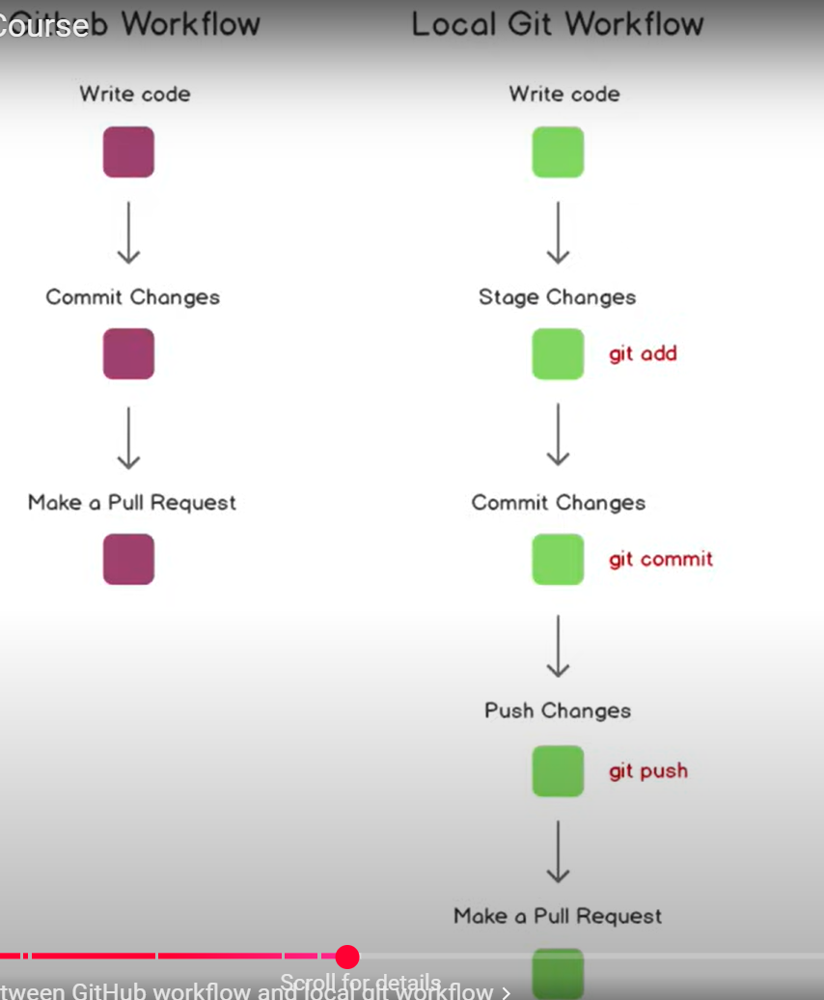

# Git and GitHub Documentation

## What is Git?
Git is a free and open-source distributed version control system that helps developers track changes in their codebase, collaborate efficiently, and manage project versions.

## What is Version Control?
Version control is the practice of managing changes to files, such as documents, source code, and websites, allowing multiple users to collaborate, track revisions, and revert to previous versions when needed.

## Important Terms
- **Directory** – A folder that contains files and subdirectories.
- **Terminal / Command Line** – An interface for executing text-based commands.
- **CLI (Command Line Interface)** – A tool to interact with the computer using commands.
- **cd (Change Directory)** – A command to navigate between directories in the command line.
- **Code Editor** – A text editor specifically designed for writing and editing code.
- **Repository** – A storage location (local or remote) where a project and its files are maintained.
- **GitHub** – A web-based hosting service for Git repositories, allowing collaboration and version management.

## Basic Git Commands

### Clone
**Command:** `git clone <repository_url>`  
Copies an existing repository (e.g., from GitHub) to your local machine.

### Add
**Command:** `git add <file>` or `git add .`  
Stages changes for tracking by Git.

### Commit
**Command:** `git commit -m "Your commit message"`  
Saves staged changes with a descriptive message.

### Push
**Command:** `git push origin <branch_name>`  
Uploads local commits to a remote repository.

### Pull
**Command:** `git pull origin <branch_name>`  
Fetches and integrates updates from the remote repository to your local machine.

## Git Status
To check the status of your repository:
```
$ git status
On branch main
Your branch is up to date with 'origin/main'.

Changes not staged for commit:
  (use "git add <file>..." to update what will be committed)
  (use "git restore <file>..." to discard changes in working directory)
        modified:   README.md

Untracked files:
  (use "git add <file>..." to include in what will be committed)
        index.html

no changes added to commit (use "git add" and/or "git commit -a")
```

## Staging Changes
To stage all modified and untracked files:
```
$ git add .
```

To verify the staged files:
```
$ git status
On branch main
Your branch is up to date with 'origin/main'.

Changes to be committed:
  (use "git restore --staged <file>..." to unstage)
        modified:   README.md
        new file:   index.html
```

## Understanding Git Push
- `-m` – Used in `git commit -m "message"` to specify a commit message.
- `origin` – The default remote repository.
- `main` – The primary branch where changes are pushed.

## Branching in Git
To list all branches:
```
$ git branch
* main
```
To push changes:
```
$ git push origin main
```
If you see an error:
```
fatal: 'origin' does not appear to be a git repository
fatal: Could not read from remote repository.
```
It means the remote repository is not set. You need to add it manually.

## Adding a Remote Repository
1. Create a new repository on GitHub.
2. Copy the repository URL.
3. Add the remote repository using:
```
$ git remote add origin <repository_url>
```
4. Verify the remote repository:
```
$ git remote -v
```
Output example:
```
origin  https://github.com/SaravananS22/demo-repo2.git (fetch)
origin  https://github.com/SaravananS22/demo-repo2.git (push)
```

## Setting Upstream Branch
```
$ git push -u origin main
```
Breaking it down:
- `git push` – Pushes local commits to the remote repository.
- `-u` (or `--set-upstream`) – Sets `origin main` as the default remote branch.
- `origin` – Refers to the remote repository.
- `main` – The branch being pushed.

After setting upstream, future pushes and pulls can be done using:
```
$ git push
$ git pull
```

This structured documentation provides a clearer understanding of Git and GitHub usage, fixing grammatical errors and improving explanations where necessary.

## Pull request


# Git Commands Documentation

## Overview
This document explains the Git commands executed during a session in the `demo-repo` repository on the `quick-test` branch. The commands performed various Git operations, such as staging, committing, resetting, and checking logs.

## Commands and Their Descriptions

### 1. Checking the Status of the Repository
```sh
$ git status
```
- This command displays the current state of the working directory and staging area.
- Initially, it showed that `README.md` was modified but not staged.

### 2. Staging a File
```sh
$ git add README.md
```
- This command staged the `README.md` file, preparing it for commit.
- Running `git status` again confirmed that the file was staged.

### 3. Resetting the Staged File
```sh
$ git reset
```
- This command unstaged `README.md`, moving it back to an untracked state.
- Running `git status` again confirmed that the file was no longer staged.

### 4. Attempting an Invalid Git Add Command
```sh
$ git add -am "changes are done"
```
- This command resulted in an error because `git add` does not support the `-am` flag.
- The correct approach is:
  ```sh
  $ git add .
  $ git commit -m "changes are done"
  ```
  - `git add .` stages all changes.
  - `git commit -m "message"` commits them with a message.

### 5. Committing the Changes
```sh
$ git commit -m "new changes are done"
```
- This command committed the staged changes with the message "new changes are done."

### 6. Resetting to the Previous Commit
```sh
$ git reset HEAD~1
```
- This command undid the last commit but retained the changes in the working directory.
- Running `git status` showed `README.md` as modified but not staged.

### 7. Viewing the Differences
```sh
$ git diff
```
- This command displayed the modifications made to `README.md`.

### 8. Viewing the Commit Log
```sh
$ git log
```
- This command displayed the commit history, including previous commits and merges.

### 9. Resetting to a Specific Commit
```sh
$ git reset 69ffae86a405b55e1df4ef82b8ea304dacdb90ff
```
- This command moved the repository back to a specific commit, unstaging `README.md` and `index.html`.

### 10. Hard Resetting to a Specific Commit
```sh
$ git reset --hard 62e93837b943d907fcb85a8990f6fb239b568d98
```
- This command forcefully reset the repository to commit `62e9383`, discarding all changes after it.

## Summary
This session covered:
- Checking repository status
- Staging and unstaging files
- Committing changes
- Resetting commits (soft and hard resets)
- Viewing commit history
- Resolving an incorrect `git add` command

Understanding these commands is crucial for efficient version control using Git.


